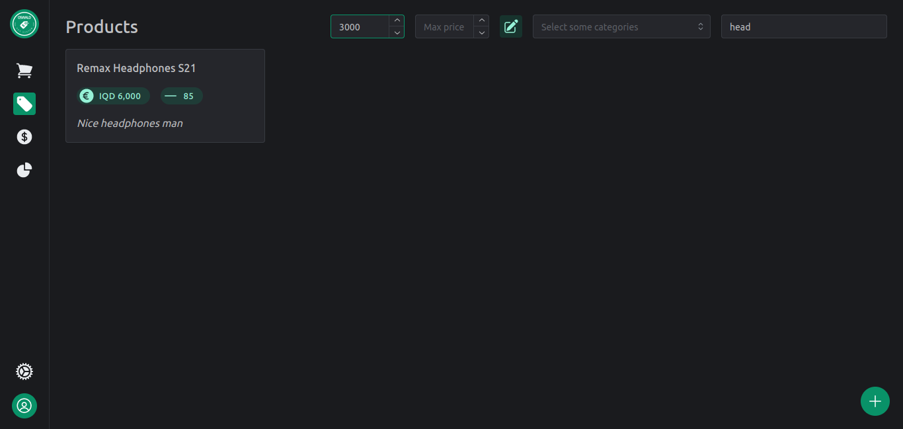

# Oswald

A POS System for small shops, available in kurdish and english.

### Stack

- Language: **Typescript**
- UI: **React** + **Mantine** + **Heroicons**
- State Manager: **Redux Toolkit**
- Translation: **React-i18next**
- Backend: **Pocketbase**

### Features

- Add wanted products to checkout, change quantity and get price total and create transactions on checkout.

  

- Filter through products using names, about, prices and categories.

  
  

- Add, edit, and remove products with categories

  
  

- Multiple checkouts for multitasking.

- View transactions and refund them.

  

- Use in multiple languages (currently in english and kurdish).
- Beautiful modern UI in multiple colours and light/dark themes.

  

- Multiple users with different roles and permissions. Authenticated and secured.

- [TODO] View your sales data in elegant charts and diagrams.
- [TODO] Attribute transactions to users.
- [TODO] Handle multiple currencies
- [TODO] Add customer creation and setting for transactions.
- [TODO] Scan product codes for checkout and product addition
- [TODO] Generate printable transaction logs
